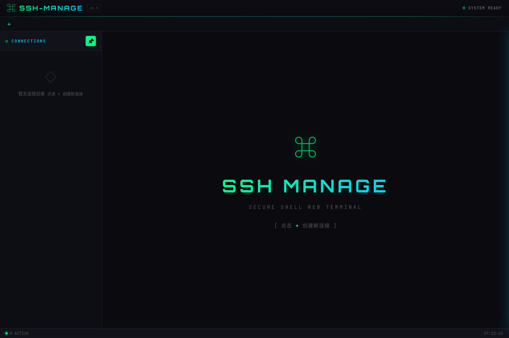
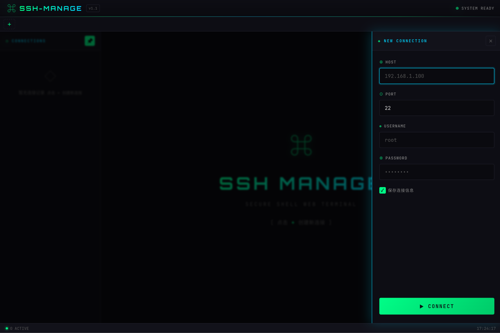

# SSH Manage

一个极客风格的 SSH Web 客户端，支持多标签页管理、连接历史保存和 SFTP 文件管理。


## ✨ 功能特性

| 功能 | 说明 |
|------|------|
| 🖥️ Web 终端 | 基于 xterm.js 的完整终端模拟 |
| 🏷️ 多标签页 | 同时管理多个 SSH 连接 |
| 💾 连接历史 | 自动保存连接信息，一键快速连接 |
| 📌 可折叠面板 | 连接列表支持固定/折叠，最大化终端空间 |
| 📂 SFTP 文件管理 | 浏览、上传、下载、删除远程文件 |
| 📤 文件夹上传 | 支持整个文件夹上传，自动创建目录结构 |
| 🗂️ 分片上传 | 大文件分片上传，支持断点续传 |
| 🎨 极客风格 | 深黑背景 + 霓虹色主题 |
| 🔒 密码认证 | 支持用户名/密码方式连接 |

## 🛠️ 技术栈

| 层级 | 技术 |
|------|------|
| 前端 | Vite + Vanilla JS |
| 终端 | xterm.js |
| 后端 | Node.js + Express |
| SSH/SFTP | ssh2 |
| 通信 | WebSocket + REST API |

## 📦 安装

```bash
# 克隆项目
git clone https://github.com/fuguimashu/ssh-manage.git
cd ssh-manage

# 安装依赖
npm install
```

## 🚀 启动

```bash
# 开发模式（同时启动前端和后端）
npm run dev

# 仅启动后端
npm run server

# 仅启动前端
npm run client

# 生产构建
npm run build
```

启动后访问：http://localhost:5173

## 📁 项目结构

```
ssh-manage/
├── package.json          # 项目配置
├── vite.config.js        # Vite 配置
├── index.html            # 主页面
├── server/
│   ├── index.js          # Express + WebSocket 服务器
│   ├── ssh-manager.js    # SSH 连接管理
│   ├── sftp-manager.js   # SFTP 文件操作
│   ├── sftp-routes.js    # SFTP REST API 路由
│   └── upload-manager.js # 分片上传管理
└── src/
    ├── main.js           # 前端入口
    ├── styles/
    │   └── index.css     # 极客风格主题
    ├── components/
    │   ├── TabManager.js     # 标签页管理
    │   ├── Terminal.js       # 终端组件
    │   ├── ConnectForm.js    # 连接表单
    │   ├── HistoryManager.js # 历史记录管理
    │   └── FileManager.js    # SFTP 文件管理器
    └── utils/
        └── websocket.js  # WebSocket 客户端
```

## 🎯 使用方法

### SSH 终端

1. 点击 **+** 按钮打开连接面板
2. 输入主机地址、端口、用户名、密码
3. 点击 **CONNECT** 建立连接
4. 连接成功后自动保存到历史记录
5. 下次可从历史记录一键快速连接

### SFTP 文件管理

1. SSH 连接成功后，点击顶部 **文件** 标签
2. 浏览远程文件系统
3. 支持以下操作：
   - 📤 **上传文件** - 单个或多个文件上传
   - 📂 **上传文件夹** - 整个文件夹上传
   - 📥 **下载文件** - 双击或右键下载
   - 🗑️ **删除** - 支持批量删除，包括非空目录
   - ✏️ **重命名** - 右键菜单重命名
   - 📁 **新建文件夹** - 创建远程目录

### 面板操作

- 📌 点击固定按钮可切换面板固定/取消固定状态
- 取消固定后面板自动隐藏，终端获得更大空间
- 鼠标悬停左侧边缘可临时展开面板

## 🖼️ 界面风格

- 深黑色背景 (#0a0a0f)
- 霓虹绿 (#00ff88) / 霓虹青 (#00d4ff) 高亮
- 扫描线视觉效果
- JetBrains Mono 等宽字体
- 发光边框和平滑动画





## 📋 更新日志

### v2.0.0
- ✨ 新增：SFTP 文件管理器
- ✨ 新增：文件/文件夹上传功能
- ✨ 新增：大文件分片上传支持
- ✨ 新增：文件下载功能
- ✨ 新增：批量删除功能（支持非空目录递归删除）
- ✨ 新增：文件重命名功能
- ✨ 新增：新建文件夹功能
- ✨ 新增：多标签切换时文件路径保持
- 🐛 修复：终端/文件视图切换时状态保持
- 🎨 优化：文件管理器支持折叠面板适配

### v1.1.1
- 🐛 修复：面板展开时终端不需要预留左边距
- 🎨 优化：终端左边距根据面板状态动态切换

### v1.1.0
- ✨ 新增：连接面板可折叠/固定功能
- 🐛 修复：终端初次连接尺寸显示问题
- 🐛 修复：连接状态变化时活跃计数不更新问题
- 🎨 优化：数字输入框样式统一

### v1.0.0
- 🎉 初始版本发布
- 基础 SSH 连接功能
- 多标签页管理
- 连接历史保存

## 📝 License

MIT

## 🙏 致谢

- [xterm.js](https://xtermjs.org/) - 终端模拟
- [ssh2](https://github.com/mscdex/ssh2) - SSH/SFTP 客户端
- [Vite](https://vitejs.dev/) - 前端构建工具
